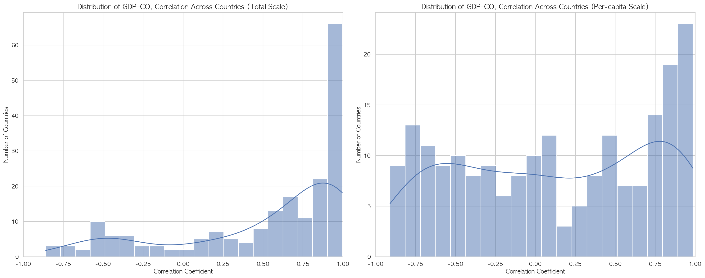
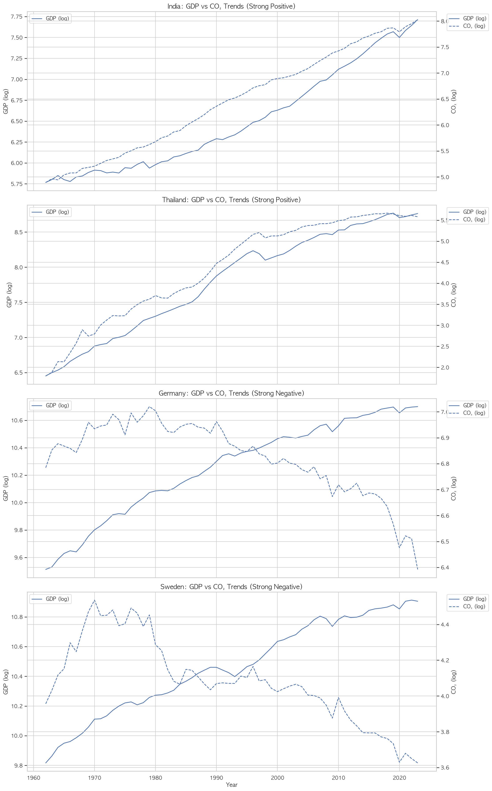
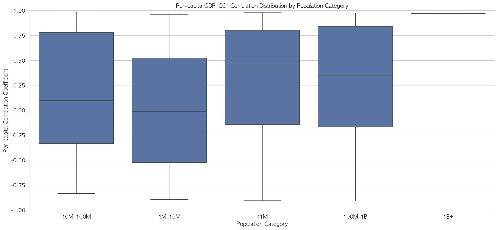
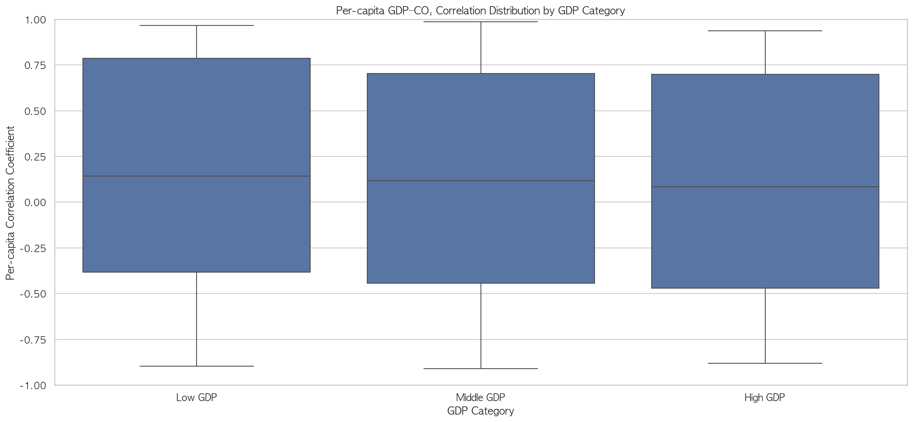
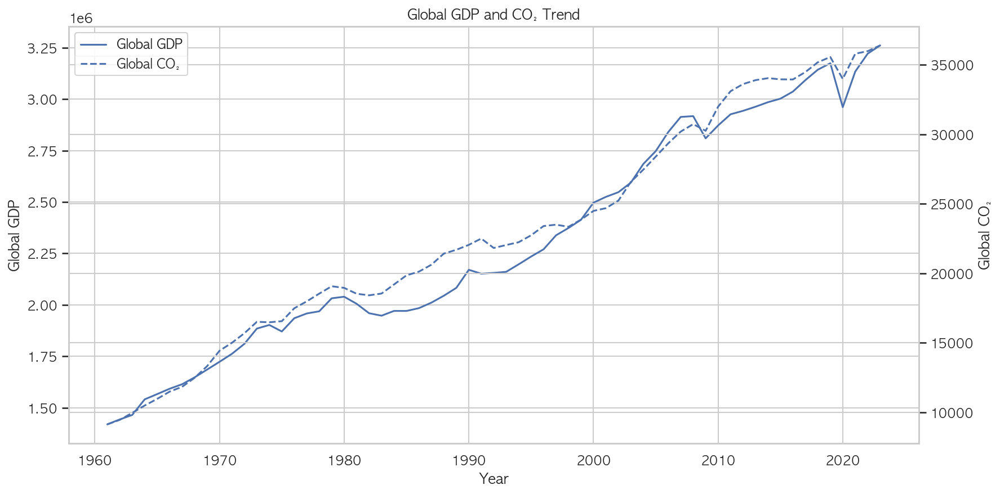
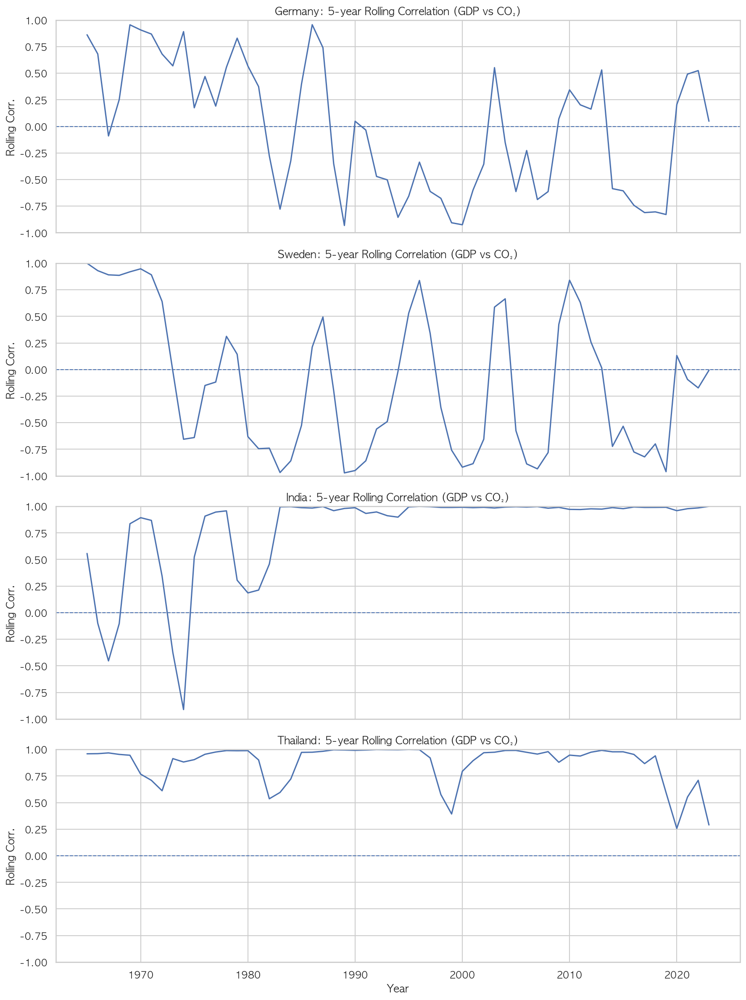
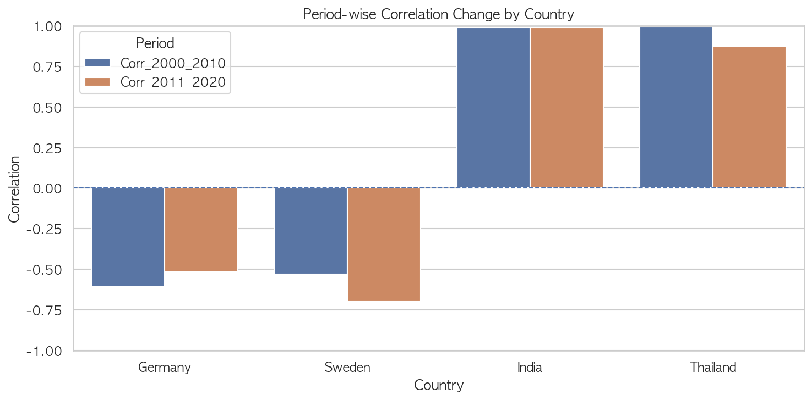
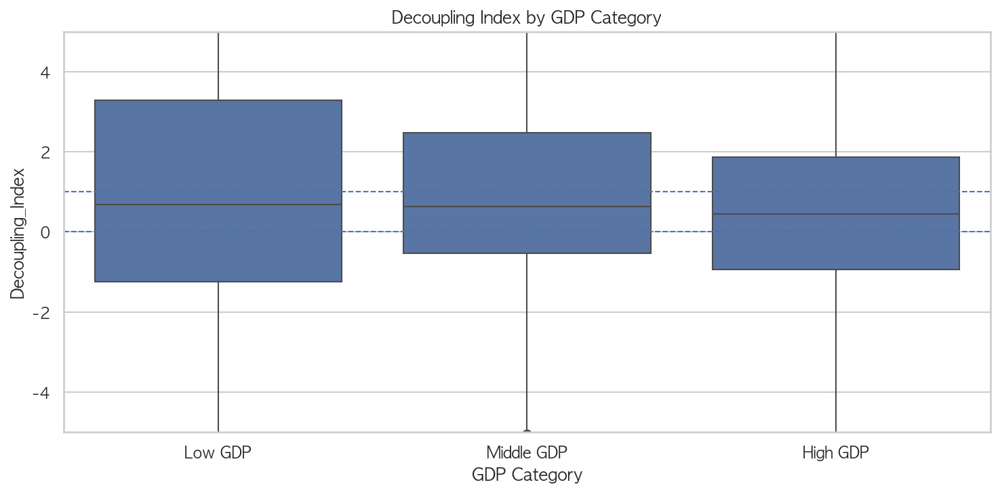
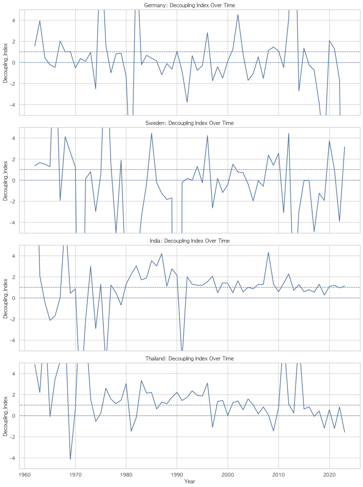

# GDP–CO₂ Analysis: Economic Growth and Carbon Emissions

> Does economic growth inevitably mean more carbon emissions — or can countries grow while decoupling from carbon?

A two-phase exploratory analysis of the relationship between GDP and CO₂ emissions across 203 countries (1960–2022).  
This project examines **where** coupling and decoupling patterns emerge, and **how** those relationships have shifted over time — with direct implications for climate policy and sustainable development.

---

## Why This Question Matters

The tension between economic growth and carbon emissions sits at the heart of climate policy.  
If growth and emissions are structurally coupled, aggressive decarbonization risks economic contraction.  
If decoupling is achievable — as some high-income countries suggest — it becomes a blueprint worth understanding.

This project investigates that question empirically across countries and decades,  
using the same GDP–CO₂ framework that underpins tools like the **Environmental Kuznets Curve** and informs **carbon pricing policy** design.

---

## Analysis Structure

This project is organized as two sequential analyses, each building on the previous.

```
Phase 1 — Where does decoupling happen?  (analysis.ipynb)
   ├── Cross-sectional correlation analysis: 203 countries
   ├── GDP growth vs CO₂ growth scatter
   ├── Country case studies: Coupling (India, Thailand) vs Decoupling (Germany, Sweden)
   └── Category-wise breakdown: by population, income, emission level

Phase 2 — How has the relationship changed over time?  (analysis_advanced.ipynb)
   ├── Global GDP and CO₂ long-run trend
   ├── 5-year rolling correlation (dynamic relationship tracking)
   ├── Period comparison: 2000–2010 vs 2011–2020
   └── Decoupling Index: CO₂ growth / GDP growth ratio
```

---

## Repository Structure

```
├── notebooks/
│   ├── analysis.ipynb                          # Phase 1: Correlation structure and cross-country patterns
│   └── analysis_advanced.ipynb                 # Phase 2: Time-series dynamics and decoupling quantification
├── figures/                                    # Phase 1 output figures
│   ├── 01_correlation_distribution.png         # GDP–CO₂ correlation distribution (total vs per-capita)
│   ├── 03_country_case_studies.png             # Coupling vs decoupling country time-series
│   ├── 07_by_gdp_category.png                  # Correlation by GDP category (total scale)
│   └── per_capita_by_gdp_category.png          # Correlation by GDP category (per-capita scale)
├── figures_advanced/                           # Phase 2 output figures
│   ├── 01_global_gdp_co2_trend.png             # Global GDP and CO₂ long-run trend
│   ├── 02_rolling_correlation.png              # 5-year rolling correlation by country
│   ├── 03_period_comparison_bar.png            # Period comparison: 2000–2010 vs 2011–2020
│   ├── 05_decoupling_index_by_gdp_category.png # Decoupling Index by GDP category
│   └── 06_decoupling_index_country_timeseries.png # Country-level Decoupling Index over time
└── report.pdf                                  # Summary report of Phase 1 findings
```

---

## Data

**Source:** [Kaggle — Global GDP and CO₂ Emissions Dataset 1960–2022](https://www.kaggle.com/datasets/mackness/global-gdp-and-co-emissions-dataset-19602022)

Download `gdp_co2_by_country_v2.csv` and place it in the same directory as the notebooks.

- **Coverage:** 203 countries, up to 63 years per country
- **Key variables:** GDP (total & per capita), CO₂ emissions (total & per capita), population, GDP category, emission category

---

## Phase 1 — Cross-Country Correlation Patterns

### Correlation Distribution: Total vs Per-Capita


*Left: total GDP–CO₂ correlations cluster strongly near +1.0 across most countries. Right: per-capita correlations spread widely across [−1, +1], with a notable left tail — the empirical signature of decoupling.*

Total GDP and total CO₂ are strongly positively correlated in most countries.  
Per-capita measures tell a different story: the distribution flattens significantly, and a meaningful subset of countries shows **negative correlation** — meaning economic growth and per-capita emissions are moving in opposite directions.

### Country Case Studies: Coupling vs Decoupling


*India and Thailand (top): GDP and CO₂ rise in lockstep. Germany and Sweden (bottom): GDP continues growing while CO₂ falls from peak levels — textbook absolute decoupling.*

| Country | Total Correlation | Per Capita Correlation | Pattern |
|---|---|---|---|
| India | +0.996 | +0.937 | Strong coupling |
| Thailand | +0.991 | +0.986 | Strong coupling |
| Germany | −0.781 | −0.836 | Decoupling |
| Sweden | −0.788 | −0.831 | Decoupling |

### Category-wise Pattern: GDP Level as Key Structural Factor


*Total scale: High GDP countries show the widest IQR and lowest median — decoupling is concentrated here, but within-group variance is large.*


*Per-capita scale: The GDP-level gradient disappears — all three groups spread similarly across [−1, +1]. Income level predicts decoupling in total terms but not in per-capita terms, pointing to population size as a confounding factor.*

The gap between total and per-capita results — and the variance within GDP categories — suggests that **population size, economic structure, and emission history all interact** to determine whether decoupling is possible.

---

## Phase 2 — Time-Series Dynamics

### Global Trend: Still Coupled at the Aggregate


*Global GDP and CO₂ have tracked closely since 1960. The 2008 financial crisis and 2020 COVID shock are both visible as simultaneous dips — even at the global aggregate, the two series remain structurally coupled.*

Despite individual country-level decoupling, **global GDP and CO₂ remain tightly linked** over the long run. This is a critical finding: decoupling at the national level does not yet translate to decoupling at the planetary level.

### Rolling Correlation: The Relationship Shifts Over Time


*5-year rolling correlation (GDP log vs CO₂ log). Germany and Sweden oscillate around zero and frequently go negative since the 1980s. India stabilizes near +1.0 from the 1990s onward. Thailand shows a weakening trend post-2010.*

A single correlation coefficient over the full period obscures important dynamics. Rolling correlation reveals that **the coupling–decoupling structure is not static** — it shifts with economic cycles, energy transitions, and policy changes.

### Period Comparison: 2000–2010 vs 2011–2020


*Germany's decoupling weakened slightly in the second period, while Sweden's deepened. India remained near +0.99. Thailand showed early signs of weakening coupling.*

| Country | 2000–2010 | 2011–2020 | Change |
|---|---|---|---|
| Germany | −0.607 | −0.516 | +0.09 |
| Sweden | −0.530 | −0.695 | −0.17 |
| India | +0.991 | +0.988 | −0.003 |
| Thailand | +0.992 | +0.876 | −0.12 |

Sweden and Germany diverge in the second period — suggesting **decoupling trajectories are country-specific** even among high-income economies.

### Decoupling Index by GDP Category


*High GDP countries have a lower median Decoupling Index and more observations below 0 — but the IQR remains large, indicating significant heterogeneity even within the high-income group.*

The Decoupling Index (CO₂ growth / GDP growth) quantifies coupling strength year by year:
- **Index < 0**: strong decoupling — CO₂ falling while GDP grows
- **0 < Index < 1**: weak decoupling — CO₂ growing slower than GDP
- **Index > 1**: coupling — CO₂ growing faster than GDP

### Country-level Decoupling Index Over Time


*Germany and Sweden frequently dip below 0 (strong decoupling), especially from the 1980s onward. India's index converges toward the 0–1 range in recent decades. Thailand shows increasing volatility post-2010.*

---

## Implications for Climate Policy

- **Carbon pricing design:** Countries in coupling phase require different policy levers — carbon taxes or ETS schemes need to be calibrated to where a country sits on the coupling spectrum
- **Technology transfer:** The structural gap between Germany/Sweden and India/Thailand suggests decoupling requires energy mix transitions, not just GDP growth
- **Trade regulations:** Border carbon mechanisms like **CBAM** implicitly attribute emissions to producing countries — but decoupling complicates this when emissions-intensive production is offshored, making consumption-based accounting an important complement

---

## Limitations & Future Work

- Correlation does not imply causality — no causal claims are made
- Production-based CO₂ is used; results may differ under consumption-based accounting
- Energy mix, industrial structure, and trade composition are not incorporated
- **Future extensions:** Panel regression with fixed effects, Environmental Kuznets Curve testing, Granger causality analysis, consumption-based emissions reallocation

---

## Environment

- **Language:** Python 3.x
- **Libraries:** pandas, numpy, matplotlib, seaborn
